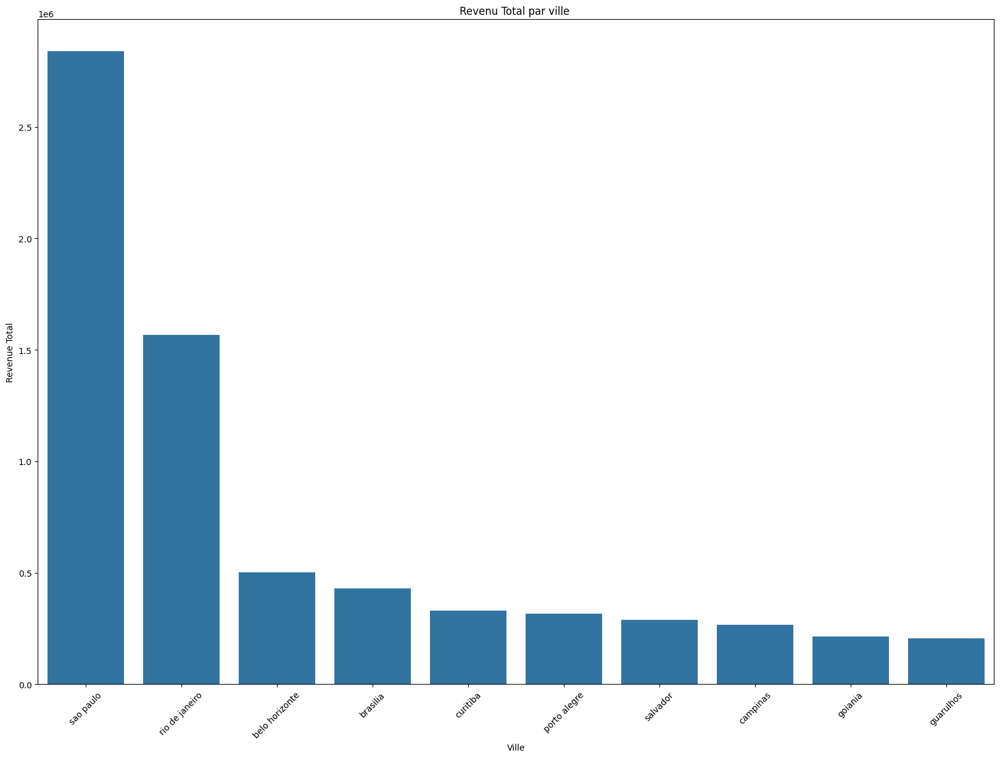
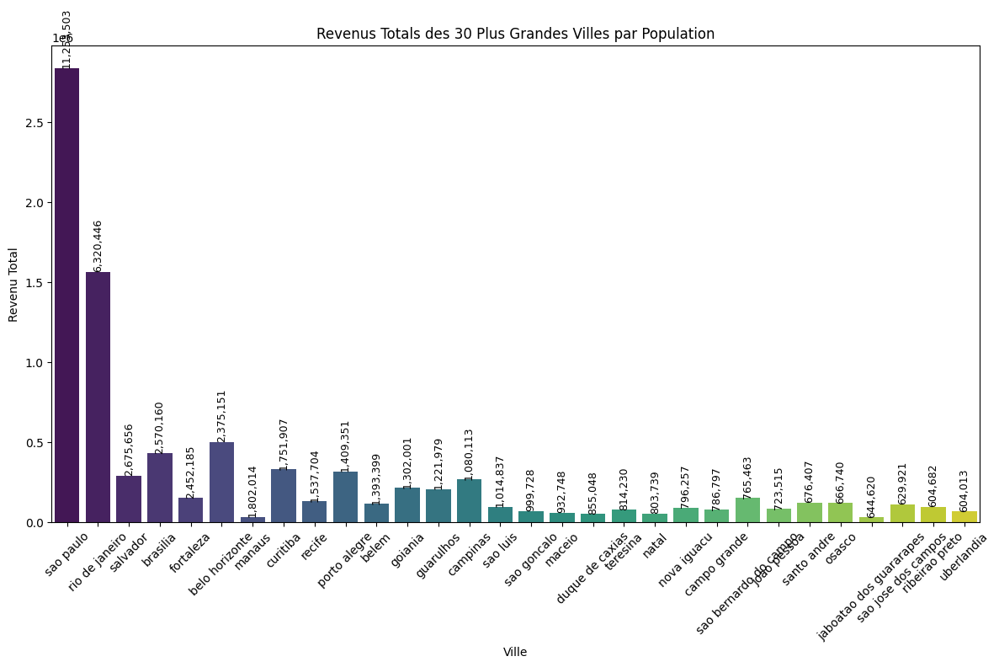
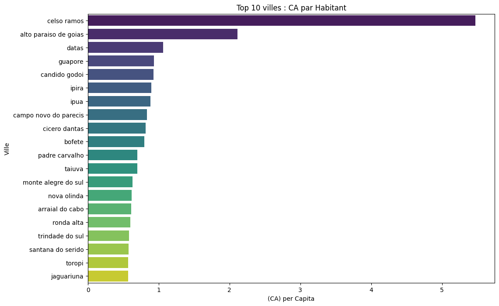
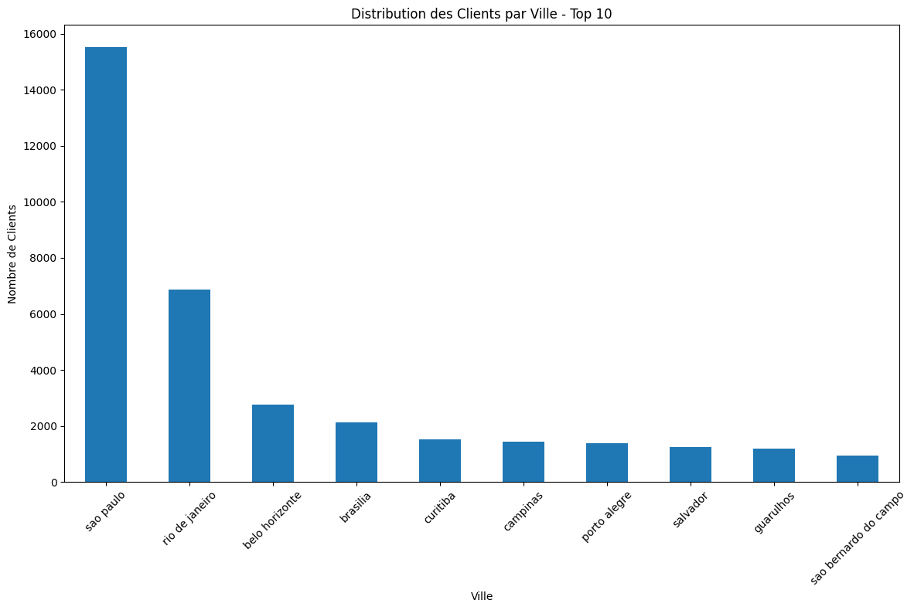
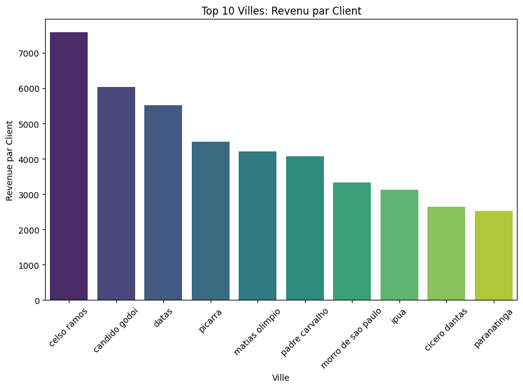
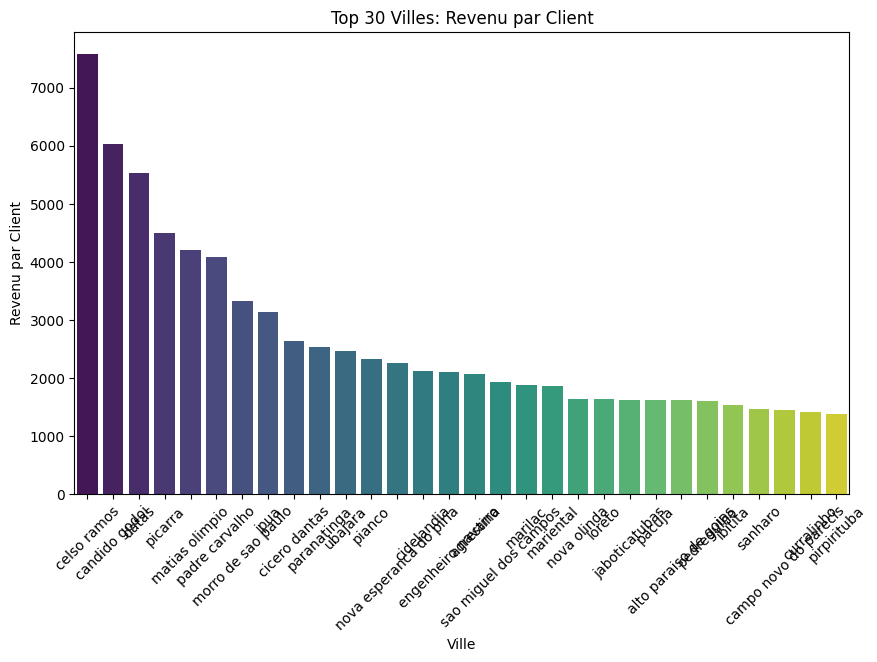
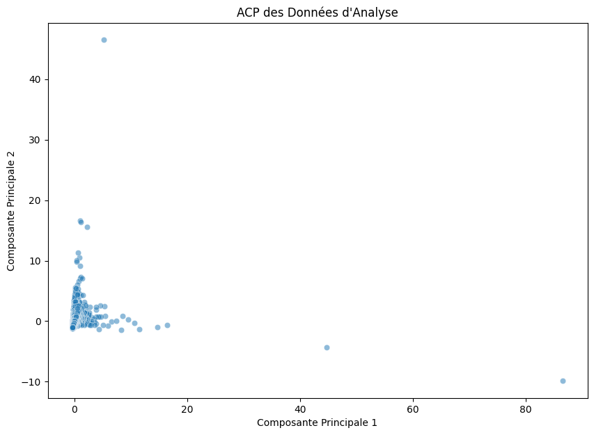
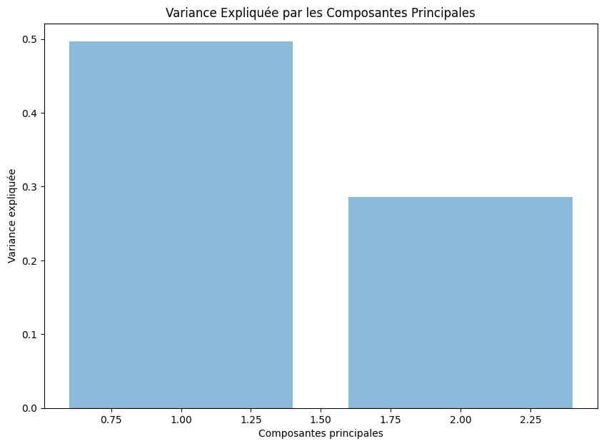
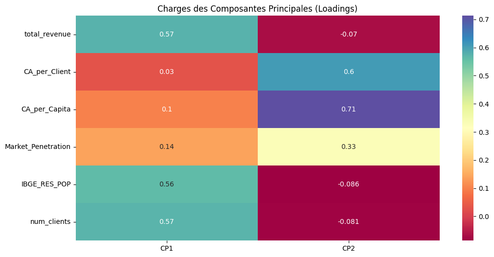

# Analyse de la rentabilité des villes

## 1. Réponse à la Problématique : "Est-ce que ce sont les plus grandes villes qui sont les plus rentables ?"

### 1.1. Calcul du revenu total par ville

Nous avons calculé le revenu total généré par chaque ville à partir des données de paiement. Cela a été effectué dans la section **"Calcul du revenu total par ville"** de notre script.

### 1.2. Mise en relation avec la population

Pour analyser la rentabilité en fonction de la taille des villes, nous avons fusionné les données de revenu avec les données de population dans la section **"Fusion des Données pour Analyse"**.

### 1.3. Visualisation et comparaison du revenu total par ville

Le graphique ci-dessous, généré dans la section **"Visualisation du Revenu Total par Ville"**, montre les villes avec le revenu total le plus élevé.

### 1.4. Calcul du chiffre d'affaires (CA) par client et par habitant

Pour une comparaison plus équilibrée, nous avons calculé le CA par client et par habitant dans la section **"Calcul des Indicateurs Clés"** de notre code.

Voici le graphique montrant les 20 principales villes selon le CA par habitant, généré dans la section **"Visualisation des Villes Principales par CA par Habitant"** :

### 1.5. Distribution des clients par ville

Nous avons analysé la distribution des clients par ville pour identifier les marchés les plus importants. Cela a été visualisé dans la section **"Distribution des Clients par Ville"** :

### 1.6. Revenu par client dans les villes

Nous avons comparé le revenu par client dans différentes villes. Voici les graphiques montrant le revenu par client dans les 10 et 30 principales villes :

- Top 10 villes :

- Top 30 villes :

## 2. Analyse de l'analyse en composantes principales (ACP)

L'ACP a été utilisée pour réduire la dimensionnalité des données tout en conservant les principales variations entre les observations. Cette analyse est détaillée dans la section **"Analyse en Composantes Principales (ACP)"**.

### 2.1. Préparation des données pour l'ACP

Les colonnes numériques pertinentes ont été sélectionnées et standardisées dans la section **"Préparation des Données pour l'ACP"**.

### 2.2. Application de l'ACP

L'ACP a été appliquée pour réduire les données à deux dimensions principales. Le graphique de la distribution des données selon les deux premières composantes principales est généré dans la section **"Application de l'ACP"**.

### 2.3. Variance expliquée par les composantes principales

La proportion de la variance totale capturée par chaque composante principale a été calculée et visualisée dans la section **"Variance Expliquée par les Composantes Principales"**.

### 2.4. Charges des composantes principales

Les charges montrent l'influence de chaque variable d'origine sur les composantes principales. Cela a été visualisé dans la section **"Charges des Composantes Principales"**.

### Conclusion de l'ACP

Les résultats de l'ACP montrent que :

- **Première Composante Principale (PC1)** : Capture environ 50% de la variance totale. Elle est principalement influencée par des mesures globales de taille et d'activité économique (`total_revenue`, `num_clients`, et `IBGE_RES_POP`).
- **Deuxième Composante Principale (PC2)** : Capture environ 30% de la variance totale. Elle est influencée par la rentabilité relative et la pénétration du marché (`CA_per_Client`, `CA_per_Capita`, et `Market_Penetration`).

Ces résultats montrent que les grandes villes avec une population importante tendent à avoir un revenu total plus élevé. Cependant, la rentabilité par habitant ou par client peut varier, ce qui permet de distinguer les villes selon des dimensions de performance économique et de rentabilité ajustées.

## Références

- **Data Sources:** Les données utilisées dans cette analyse proviennent des datasets suivants :
  - `olist_order_payments_dataset.csv`
  - `olist_order_reviews_dataset.csv`
  - `olist_customers_dataset.csv`
  - `olist_geolocation_dataset.csv`
  - `olist_order_items_dataset.csv`
  - `olist_products_dataset.csv`
  - `olist_orders_dataset.csv`
  - `olist_sellers_dataset.csv`
  - `product_category_name_translation.csv`
  - `BRAZIL_CITIES.csv`
